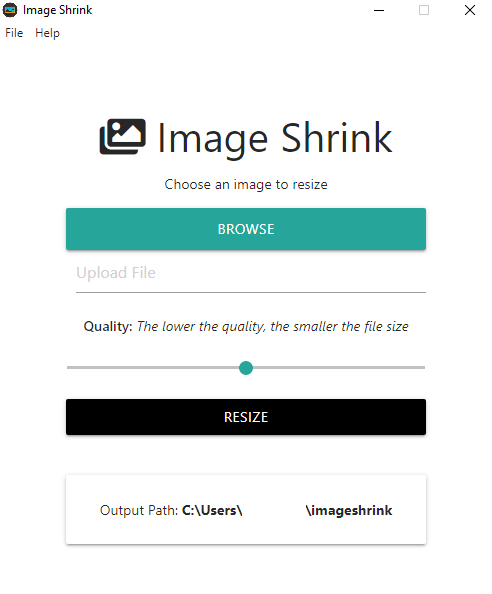
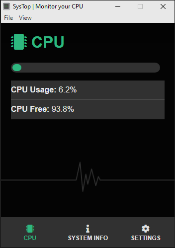
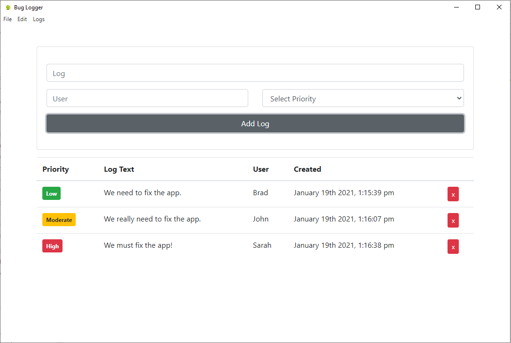

# Bug Logger App and Electron projects

This repo is made of 3 projects:

1. [**Image Shrink**](#imageshrink): An image optimizer app to understand Electron basics.
2. [**SysTop**](#systop): An app to monitor CPU usage.
3. [**Bug Logger**](#buglogger): An app bug tracker for teams.

## 1) Image Shrink

An image optimizer app to understand Electron basics.

[See image-shrink folder](https://github.com/solygambas/electron-react-bug-logger/tree/master/image-shrink)

    

### Features

- loading a window file and adding an icon.
- using Nodemon with Electron.
- creating a menu template, using roles and global shortcuts.
- building the interface with Materialize CSS and Font Awesome.
- integrating with Node and handling IPC communication.
- implementing Imagemin with mozjpeg and pngquant to shrink JPEG and PNG files.
- sending events to renderer and displaying a user-friendly notification.
- enabling log files with electron-log.
- packaging our app with electron-packager and testing it.

## 2) SysTop

An app to monitor CPU usage.

[See systop folder](https://github.com/solygambas/electron-react-bug-logger/tree/master/systop)

    

### Features

- using a boilerplate and creating the interface.
- getting static and dynamic system stats with node-os-utils.
- monitoring CPU overload with a user-friendly progress bar.
- displaying alerts at regular interval with Notifications API.
- storing user settings on local data.
- creating a tray icon and handling clicks.
- extending MainWindow class.
- packaging our app with electron-packager and testing it.

## 3) Bug Logger

An app bug tracker for teams.

[See bug-logger folder](https://github.com/solygambas/electron-react-bug-logger/tree/master/bug-logger)

    

### Features

- ...

Based on [Electron From Scratch: Build Desktop Apps With JavaScript](https://www.udemy.com/course/electron-from-scratch/) by Brad Traversy (2020).
